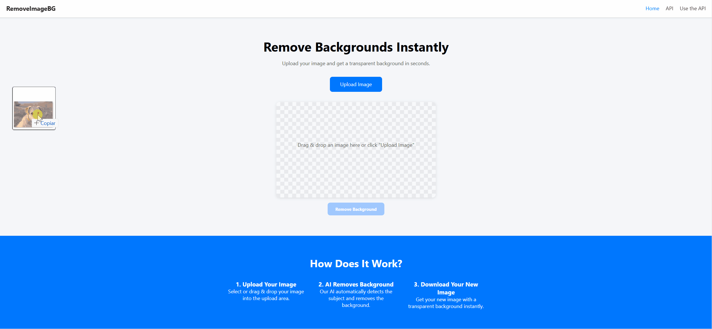

# 🖼️ Remove Image BG


Open-source project to **automatically remove image backgrounds** using [rembg](https://github.com/danielgatis/rembg).  
It provides a **REST API built with Django and DRF** to process images in-memory and return transparent PNGs, without saving files to disk.  

This project is ideal for:  
- **E-commerce** → quickly cleaning up product photos  
- **Design and Marketing** → preparing assets with transparent backgrounds  
- **Developers** → integrating AI background removal into apps and workflows  

A simple **frontend** (HTML, CSS, and JavaScript) is also included for quick testing and demonstration.

---

## 🚀 Features

- ✅ Background removal via AI ([rembg](https://github.com/danielgatis/rembg))  
- ✅ REST API built with Django + DRF  
- ✅ Ready-to-use frontend for testing  
- ✅ No image stored on disk (processed in-memory only)  
- ✅ CORS enabled for frontend-backend integration  

---

## 📸 Visual Demo



---

## 📑 Table of Contents

- [Description](#-remove-image-bg)
- [Features](#-features)
- [Visual Demo](#-visual-demo)
- [Installation](#-installation)
- [Usage](#-usage)
- [Technologies Used](#-technologies-used)
- [Project Structure](#-project-structure)
- [Interactive API Docs](#-interactive-api-docs)
- [Testing](#-testing)
- [Contributing](#-contributing)
- [License](#-license)

---

## ⚙️ Installation

### Requirements
- Python 3.10+
- [pip](https://pip.pypa.io/en/stable/)
- Virtualenv (recommended)

### Steps

```bash
# Clone repository
git clone https://github.com/MatheusBarbosaSE/remove-image-bg.git
cd remove-image-bg

# Create and activate virtual environment
python -m venv .venv
source .venv/bin/activate  # Linux/Mac
.venv\Scripts\activate   # Windows

# Install dependencies
pip install -r requirements.txt

# Run migrations
cd backend
python manage.py migrate

# Start server
cd backend
python manage.py runserver
```

---

## 💻 Usage

There are multiple ways to use the API and frontend:

### 1. Using `curl`

```bash
curl -X POST -F "image=@example.jpg" http://127.0.0.1:8000/api/remove-background/ --output result.png
```

### 2. Using Python `requests`

```python
import requests

url = "http://127.0.0.1:8000/api/remove-background/"
files = {"image": open("example.jpg", "rb")}
response = requests.post(url, files=files)

with open("result.png", "wb") as f:
    f.write(response.content)
```

### 3. Using Postman
- Open [Postman](https://www.postman.com/downloads/)  
- Create a **POST request** to `http://127.0.0.1:8000/api/remove-background/`  
- Under the **Body** tab, choose **form-data** and add a key `image` with type **File**  
- Upload an image and send the request  
- The response will be the processed PNG  

### 4. Using the included Frontend
A simple frontend is available in the `frontend/` folder.

Recommended way to run:  
- Install the **Live Server** extension in VS Code: [Live Server](https://marketplace.visualstudio.com/items?itemName=ritwickdey.LiveServer)  
- Right-click `index.html` and select **“Open with Live Server”**  

✅ Reason: Live Server automatically reloads changes and serves your HTML/JS over `http://127.0.0.1:5500/`, which is required for CORS to work correctly with the backend.

---

## 🛠 Technologies Used

- **Backend**
  - [Python](https://www.python.org/)
  - [Django](https://www.djangoproject.com/)
  - [Django REST Framework](https://www.django-rest-framework.org/)
  - [rembg](https://github.com/danielgatis/rembg) (AI background removal)
- **Frontend**
  - HTML, CSS, Vanilla JavaScript
- **Others**
  - [Pillow](https://python-pillow.org/) for image handling in tests
  - [django-cors-headers](https://github.com/adamchainz/django-cors-headers) for CORS support
  - [python-decouple](https://github.com/henriquebastos/python-decouple) for environment variables
  - [drf-yasg](https://github.com/axnsan12/drf-yasg) for Swagger and ReDoc API documentation

---

## 📂 Project Structure

```bash
remove-image-bg/
│
├── backend/              # Django backend
│   ├── config/           # Project settings, urls, wsgi/asgi, api_docs
│   ├── remover/          # App: background removal (views, serializers, tests)
│   └── manage.py         # Django CLI
│
├── frontend/             # Static demo frontend (HTML, CSS, JS, assets)
│
├── demo/                 # Media used in README
│
├── .gitignore            # Ignore rules for Git
├── LICENSE               # MIT license
├── README.md             # Project documentation
└── requirements.txt      # Python dependencies
```

---

## 📖 Interactive API Docs

In addition to the frontend, this project also provides interactive documentation for the API:

### 1. DRF Browsable API
- URL: [http://127.0.0.1:8000/api/remove-background/](http://127.0.0.1:8000/api/remove-background/)  
- Built-in documentation provided by Django REST Framework.  
- Allows uploading an image directly from the browser form and testing the response.  

### 2. Swagger UI
- URL: [http://127.0.0.1:8000/swagger/](http://127.0.0.1:8000/swagger/)  
- Interactive OpenAPI documentation powered by **drf-yasg**.  
- Supports file upload, shows request/response examples, and auto-generates `curl` commands.  

### 3. ReDoc
- URL: [http://127.0.0.1:8000/redoc/](http://127.0.0.1:8000/redoc/)  
- Clean, developer-friendly API documentation.  
- Useful for exploring schema definitions and error responses.  

You can also access the raw OpenAPI schema at:
- JSON: [http://127.0.0.1:8000/openapi.json](http://127.0.0.1:8000/openapi.json)  
- YAML: [http://127.0.0.1:8000/openapi.yaml](http://127.0.0.1:8000/openapi.yaml)  

---

## 🧪 Testing

Run the automated tests to validate API behavior:

```bash
cd backend
python manage.py test
```

The test suite covers:  
- ✅ Successful background removal (returns PNG with transparency)  
- ✅ Missing file (400 Bad Request)  
- ✅ Invalid file type (400/415 error)  
- ✅ Method not allowed (GET instead of POST)  
- ✅ CORS preflight (OPTIONS request)  

---

## 🤝 Contributing

1. Fork the repository
2. Create a feature branch (`git checkout -b feature/new-feature`)
3. Commit your changes (`git commit -m 'feat: add new feature'`)
4. Push to the branch (`git push origin feature/new-feature`)
5. Open a Pull Request

Feel free to open **issues** for bug reports or suggestions.

---

## 📄 License

This project is licensed under the **[MIT License](LICENSE)**.  
You are free to use, copy, modify, and distribute this software, provided you keep the original credits.
